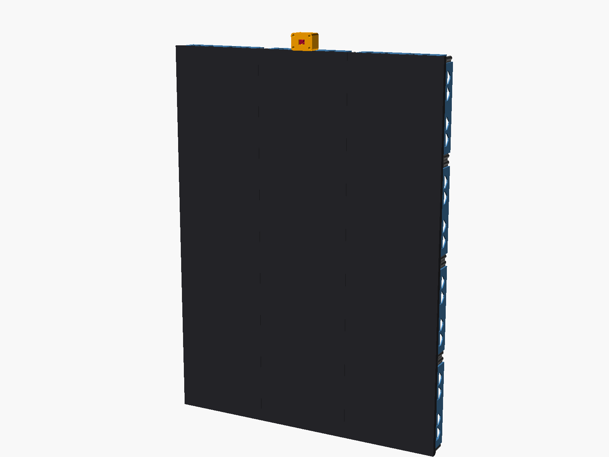

# LED wall frame – 3 × 4 P4 64×64 panels (256 mm), Pi inside, camera pod

3D-printable mounting frame for the magic mirror's LED wall: twelve P4 64×64 HUB75 panels
(256 × 256 mm, `P4-2121-64X64-32S`) in a 3 × 4 grid, 768.6 × 1024.9 mm overall.
The Raspberry Pi 4/5 + HUB75 shield and the 5 V 40 A supply live inside the 46 mm deep frame;
a small pod on the top edge holds the Pi Camera Module 3 in portrait, tilted 15° down.

Everything prints support-free on a Prusa CORE One (250 × 220 mm bed).



## Files

| Path | What |
|---|---|
| `p4_frame_v3.scad` | Parametric OpenSCAD source (all parts, plates, assembly preview) |
| `stl/frame_46mm/` | Complete frame, print plates ready for the CORE One |
| `stl/addons_for_existing_rails/` | Pi tray, PSU tray and camera pod that clip into the windows of already-printed standard rails |
| `digital_assembly_FINAL_B.glb` | Full digital assembly (open in Blender / Windows 3D Viewer) |
| `images/` | Renders |

### Print list – full frame (`stl/frame_46mm/`)
- `00_fit_test_PRINT_FIRST`, `00b_DOVETAIL_GAUGE_c005_c010_c015` (set `c` in the SCAD to the socket that fits best)
- `01_nodes_junction_x6`, `02_nodes_edge_x10_corner_x4`
- `03_rails_vertical_x7`, `04_rails_vertical_x1_horizontal_x6`, `05_rails_horizontal_x2_outer_x6`, `06_rails_outer_x7_top_mount_x1`
- one of `07a/07b/07c` – Pi rail (self-tap / heat-set inserts / bolt + nut; Pi 4 and Pi 5 share the 58 × 49 mm M2.5 pattern)
- `08_camera_pod_body_and_lid`
- `10_psu_tray_horizontal_A-200AF-5`
- `OPTIONAL_09_wall_ears_set` – only if using ear brackets instead of keyholes

### Add-ons for rails you already printed (`stl/addons_for_existing_rails/`)
- one of `C1a/C1b/C1c` – Pi tray (top-middle cell, hooks into the vertical rails' windows)
- `C2_psu_tray_horizontal_A-200AF-5`
- `C3_camera_pod_clip_on_body_and_lid` – sits on the standard middle top rail
- Fit both the earlier trapezoid windows and the current larger ones.

## Print settings
PETG · 0.4 mm nozzle · 0.20 mm layers · 5 perimeters · 40 % gyroid · 5 top/bottom ·
no supports, no brim · keep elephant-foot compensation on · print as laid out (panel side down).
About 2 kg of filament for the full frame.

## Hardware
- 84 × M3 × 25 flat-head countersunk (DIN 7991 / ISO 10642) + long 2 mm hex key
- Camera pod: 4 × M3 × 12 countersunk (lid), 4 × M2 × 5 self-tapping (camera); 2 × M3 × 12 to the top-mount rail (full-frame version)
- Pi: 4 × M2.5 × 6 (+ inserts or nuts for 07b/07c, C1b/C1c)
- Pi 5 camera cable 22→15 pin, 500 mm (Pi 4: 15→15 pin)
- CZCL A-200AF-5 (190 × 84 × 30 mm) + 2 zip ties ≥ 300 × 4.8 mm; a few small zip ties for the clip-on trays
- 6 wall screws, head ≤ 8.2 mm, standing ~5 mm proud, with anchors (keyholes on the 256.3 mm grid)

## Assembly
1. Panels face down on a soft mat, all arrows on the back pointing the same way.
2. Nodes on the corner inserts, drop the rails in (dovetails slide down), screw everything (horizontal rails: engraved arrow up).
3. Pi on its rail/tray behind the top-middle panel; PSU tray hooks into the window pairs either side of the bottom-middle panel.
4. Camera pod on the top-centre rail, camera cable down through the rail window.
5. Hang on six wall screws.

## Notes
- Pi + shield stack is assumed ≤ 32 mm above the Pi board (`pi_stack`); frame depth `H = 46`.
- One 200 W supply is short for 12 panels at full white (~240 W): cap brightness (e.g. `--led-brightness`) or add a second supply.
- Mains: cover the AC terminals, strain-relieve the cable, fuse/switch outside the frame.

## Regenerating parts
```
openscad -D H=46 -D 'variant="B"' -D 'part="plate_rails_A"' -o rails.stl p4_frame_v3.scad
```
Parts: `junction edge corner rail_v_inner rail_h_inner rail_outer rail_top_mount rail_h_pi box_B_body box_B_lid psu_tray pi_tray box_C_body box_C_lid`;
plates: `plate_nodes_A plate_nodes_B plate_rails_A plate_rails_B plate_rails_C2 plate_rails_D_top plate_pi_rail_B plate_cam_pod_B plate_psu_tray plate_pi_tray plate_cam_pod_C plate_ears`.
